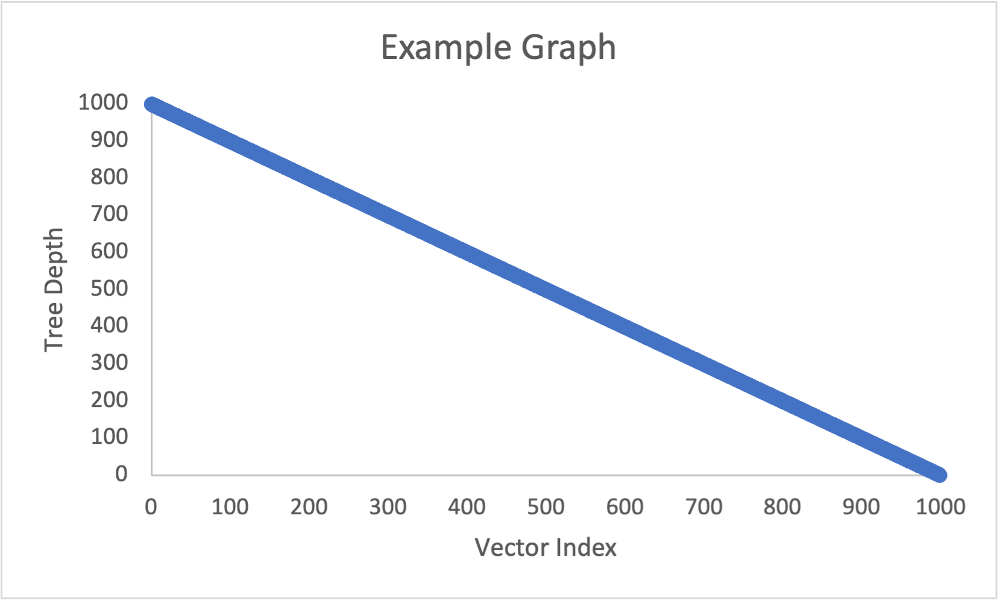

# Project 3 Report

Answer the following questions directly in this file:
* You will have a different grader again, so make sure your report includes information about your dataset.
* How do the depths of the random-ordered integers compare to the depths of the ordered integers for each tree? Why?
* How do the depths of each custom-data-type tree compare to each other?
* Why do the depths of the second custom-data-type Splay Tree make sense?
* Graph the Binary Search Tree, AVL Tree, and Splay Tree depths for the custom data type trees. Do not use C++ to graph, you can use whatever spreadsheet application or graphical programming language you prefer. You can use whatever graph is most readable to you (e.g. scatter plot, histogram, etc.).
  * Your graphs should have clear labels for both x and y axes.
  * Save your graph files in the graphs folder.
  * You do not need to graph the depths of the integer type trees or the Splay Tree that finds each object 5 times in a row, but you can if you feel it helps you analyze the data.
  * An example graph spreadsheet and an example graph image have been included in the starter code.
  * Here is how you include an image in your Report.md file: 
* Compare and contrast the graphs and explain the differences based on what you know about the structure and behavior of the trees. Justify the time complexity of searching the trees based on the results.

**Note: Any code that was not authored by yourself or the instructor must be cited in your report. This includes the use of concepts not taught in lecture.**